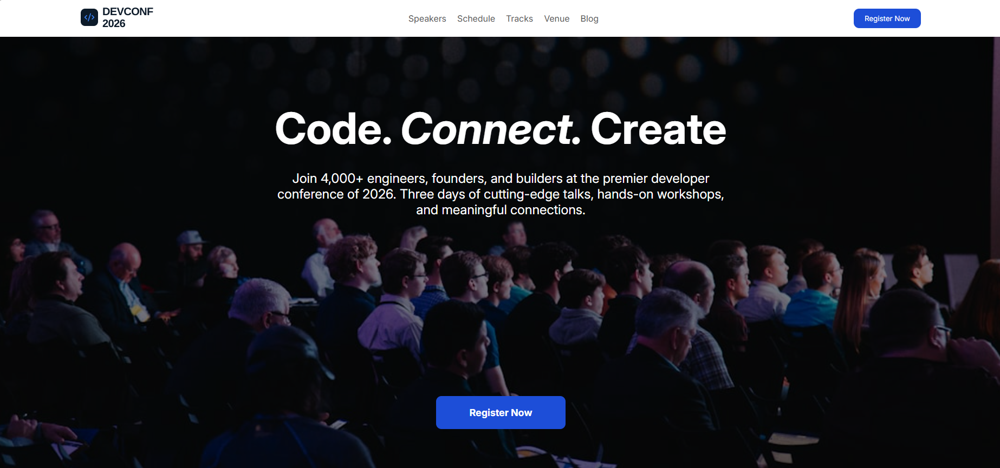

🚀 DevConf 2026

A modern and responsive landing page for DevConf 2026, a developer-focused conference designed for software engineers, founders, students, product managers, and technology enthusiasts.

The website presents the conference experience through a clean and professional UI, featuring event highlights, speakers, ticket pricing, FAQs, and a strong call-to-action for registration.

🌐 Live Demo

🔗 Live Website: https://tanvirahmedmahin10.github.io/B14-A01/

📦 GitHub Repository: https://github.com/tanvirahmedmahin10/B14-A01

📸 Project Preview

Here’s a preview of the DevConf 2026 landing page, showcasing its modern, responsive design and conference-focused UI.

  

✨ Features
🎯 Modern DevConf 2026 conference landing page
🖥️ Hero/banner section with conference introduction
👨‍💻 Featured speaker section
💳 Multiple ticket and pricing plans
Standard
Pro
Team
❓ Frequently Asked Questions section
📱 Responsive layout for different screen sizes
🎨 Clean and professional visual design
🔵 Consistent blue-based color scheme
🖼️ Custom image and branding assets
🔤 Inter font integration through Google Fonts
🧩 Pure HTML and CSS implementation
🛠️ Technologies Used
Frontend
HTML5 — Website structure and semantic content
CSS3 — Styling, layout, responsive design, and visual presentation
Google Fonts — Inter typography
Tools
Git
GitHub
VS Code or any modern code editor

Dependencies:
This project does not require React, Node.js, npm, or any external JavaScript framework.

📂 Project Structure
B14-A01/
│
├── assets/
│   ├── andrej.png
│   ├── banner.jpg
│   ├── demis.png
│   ├── facebook.png
│   ├── footer-logo.png
│   ├── gary.png
│   ├── insta.png
│   ├── logo-mini.png
│   ├── logo.png
│   ├── mustafa.png
│   └── twitter.png
│
├── Devconf.png
├── index.html
├── style.css
├── PROMPTS.md
└── README.md

👨‍💻 Featured Speakers

The landing page includes a dedicated speaker section featuring:

Andrej Karpathy — AI / ML
Demis Hassabis — Cloud & DevOps
Gary Marcus — Frontend
Mustafa Suleyman — Security
🎟️ Pricing Plans
Standard — $399

Includes:

Access to all 3 conference days
48 curated technical talks
2 workshop sessions
Networking lunch & coffee breaks
Conference swag bag
Digital recordings for 30 days
Pro — $749

Includes everything in Standard, plus:

Unlimited workshop access
Speaker meet & greet
VIP networking dinner
Lifetime recording access
Team — $5,999

Includes:

Everything in Pro for up to 10 people
Dedicated team lounge access
Private workshop booking
Company logo on event page
Recruitment booth
Priority customer support
❓ FAQ

The project includes an FAQ section covering common questions about:

Who should attend DevConf
Session recordings
Meals and refreshments
Ticket transfers
🚀 Getting Started

Since this is a static HTML/CSS project, no package installation or build process is required.

1. Clone the Repository
git clone https://github.com/tanvirahmedmahin10/B14-A01.git

2. Navigate to the Project
cd B14-A01

3. Open the Project

You can simply open index.html in your browser.

For a better development experience, use VS Code + Live Server.

Using Live Server
Open the project folder in VS Code.
Install the Live Server extension.
Right-click on index.html.
Select Open with Live Server.
The website will open in your browser.
🌍 Deployment

This project is deployed using GitHub Pages.

🔗 Live Website: https://tanvirahmedmahin10.github.io/B14-A01/

Because this is a static HTML/CSS website, it can also be deployed using platforms such as:

GitHub Pages
Netlify
Vercel
🔗 Relevant Links
🌐 Live Demo: https://tanvirahmedmahin10.github.io/B14-A01/
📦 GitHub Repository: https://github.com/tanvirahmedmahin10/B14-A01
👤 GitHub Profile: https://github.com/tanvirahmedmahin10
📚 Learning Outcomes

Through this project, the following frontend development concepts were practiced:

Semantic HTML structure
CSS layout and styling
Responsive web design
Flexbox and modern CSS techniques
Typography and Google Fonts
Image and asset management
Component-like section organization
Git and GitHub workflow
Static website deployment with GitHub Pages
📄 License

This project was created for educational and portfolio purposes.
